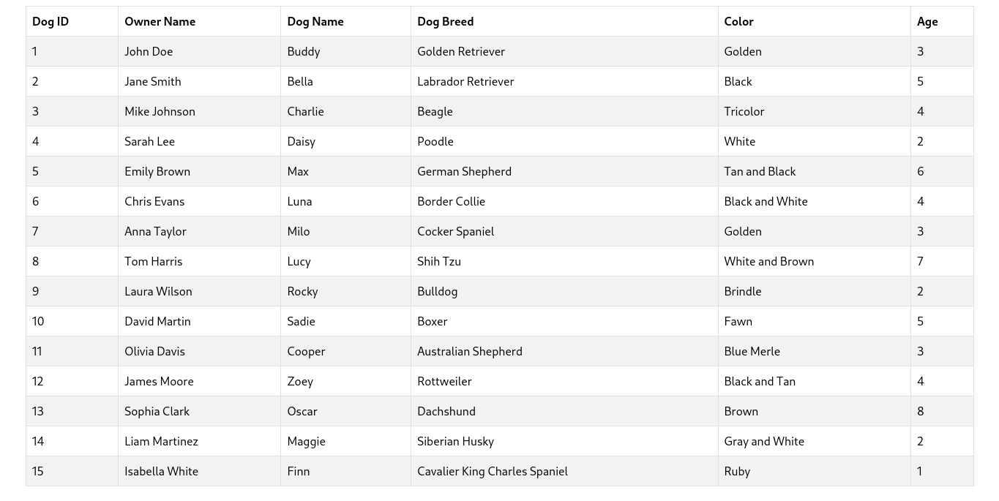

## Exam Two: Practical MVC Web Application for Dog Information

#### Objective
Create a simple web application using the **Model-View-Controller (MVC) pattern**. The application will provide a single-page list view of dog information retrieved from a MySQL database. The project assesses your understanding of MVC architecture, MySQL database interaction, and web programming.

---

### Instructions

1. **Database Setup**: 
   Run the following command to create the dogsDB and populate with data.
   ```
   sudo mysql < dogs.sql
   ```

2. **Model**:
   Implement and test the PHP files, **Dog.php**, and **DogDAO.php** to implement the model to retrieve all dogs from the database.

3. **View**:  
   Implement and test the PHP file, **listView.php** that displays all the dogs in a table format. Each row should display the information for all of the fields in the dogs table. Use *Bootstrap* to format the table and page.
   
4. **Controller**:  
   Implement and test the PHP file, **dogController.php** that functions as the controller for the application and is the target for all HTTP requests.  The following request url should display the page with the dog information:
   ```
   http://localhost/exam2/dogController.php?action=list
   ```  


---

5. **Application Structure**:  
   - Follow the directory structure below:  
     ```
     /exam2
     ├── dogController.php
     ├── dogs.sql
     ├── /model
     │   └── Dog.php
     │   └── DogDAO.php
     ├── /views
     │   └── listView.php
   
     ```

### Exam Submission

Push your repo to GitHub Classroom and ***upload the Zip of your Repo to the BlackBoard Assignment***. I will grade the zipped repo.

